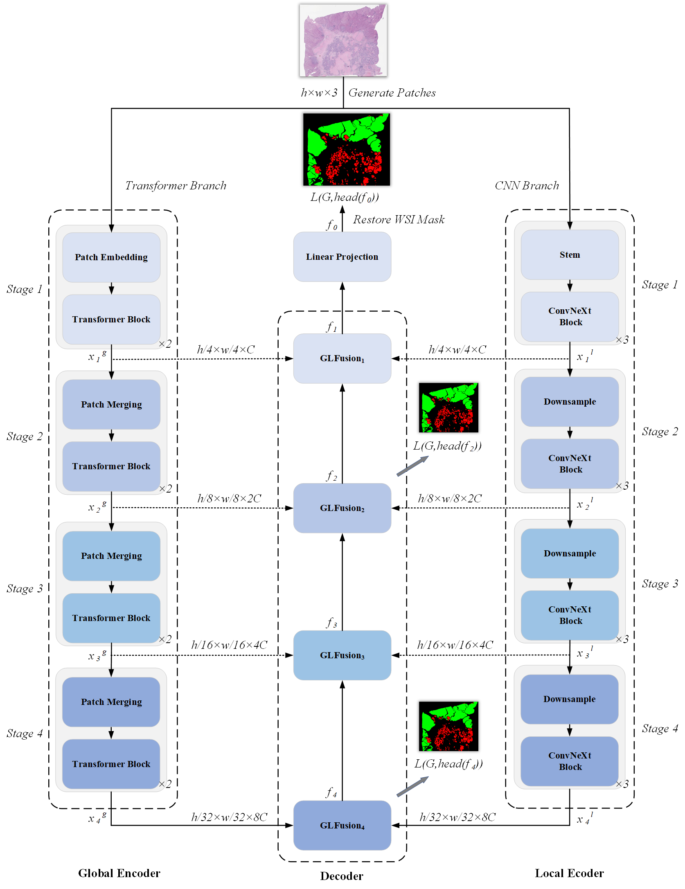

# DHUnet
The codes for the paper "[DHUnet: Dual-branch Hierarchical Global-local Fusion Network for Whole Slide Image Segmentation](https://doi.org/10.1016/j.bspc.2023.104976)"

## Abstract

Hematoxylin and eosin stained whole slide images (WSIs) are the gold standard for pathologists and medical professionals for tumor diagnosis, surgery planning, and postoperative examinations. In recent years, due to the rapidly emerging field of deep learning, there have been many convolutional neural networks (CNNs) and Transformer based models applied to computational pathology for accurate segmentation. However, the generalization ability and robustness of models often affect the diagnosis and prognosis of cancer, and we attempt to effectively combine the advantage of CNN which excels in sparse WSI segmentation while Transformer excels in dense cases. In this paper, We propose a novel feature fusion strategy, DHUnet, which utilizes Swin Transformer and ConvNeXt modules with a dual-branch hierarchical U-shaped architecture to fuse global and local features for WSI segmentation. Firstly, a WSI is divided into small patches, which are put into the global and local encoders to generate hierarchical features in parallel. Then, with the help of global-local fusion modules and skip connections, the decoder can fully obtain the global coarse and local fine-grained information during the upsampling process. The proposed Cross-scale Expand Layer can make the patches with the same center but different scales recover the input resolution gradually at each stage. Finally, all the projected pixel-level patch masks are merged to restore the final WSI tumor segmentation. Extensive experiments demonstrate that DHUnet has excellent performance and generalization ability for WSI segmentation, achieving the best segmentation results on three datasets with different types of cancer, densities, and target sizes.

## Requirements
```shell
pip install -r requirements.txt
```
## Pre-trained Checkpoints
The official pre-trained checkpoints are available at [Google Drive](https://drive.google.com/file/d/1spDwAM8eqfPx97wPBJbd1frkFPdKDd7g/view?usp=sharing).
## Dataset
The processed datasets and trained models are publicly available at [Google Drive](https://drive.google.com/drive/folders/1cEHr1YPE3fuJ0AKlJtWHOZ_vLKMcdQPa?usp=sharing).
### Liver
* The Third Xiangya Hospital of Central South University provides the data support.
### WSSS4LUAD
* The raw data is obtained from [WSSS4LUAD lung cancer challenge](https://wsss4luad.grand-challenge.org/WSSS4LUAD/).
### BCSS
* The raw data is obtained from [BCSS breast cancer challenge](https://bcsegmentation.grand-challenge.org/BCSS/).

### Dataset Organization
You should orginize your own dataset like below:
```python
data
│───[Dataset Name 1]
│   └───WSI
│       │   wsi_1.svs / wsi_1.png
│       │   wsi_1.xml / gt_wsi_1.png
│       │   wsi_2.svs / wsi_2.png
│       │   wsi_2.xml / gt_wsi_2.png
│       │           ...
│       │   wsi_n.svs / wsi_n.png
│       │   wsi_n.xml / gt_wsi_n.png
│───[Dataset Name 2]
│   └───WSI
│       │   wsi_1.svs / wsi_1.png
│       │   wsi_1.xml / gt_wsi_1.png
│       │   wsi_2.svs / wsi_2.png
│       │   wsi_2.xml / gt_wsi_2.png
│       │           ...
│       │   wsi_n.svs / wsi_n.png
│       │   wsi_n.xml / gt_wsi_n.png
└───read_xml.py # convert *.xml file to *.png
```

### Dataset Preprocessing and Spliting
```python
python wsi2patch.py --dataset Liver --data_dir data/Liver/WSI --output data/Liver --lists_dir lists/lists_Liver/ --overlap 224 --patch_size 448
```
## Train
```python
python train.py --dataset Liver --network DHUnet --cfg configs/DHUnet_224.yaml --root_path data --max_epochs 50 --output_dir model-Liver/DHUnet --img_size 224 --base_lr 0.005 --batch_size 24
```

## Test
```python
python test.py --dataset Liver --network DHUnet --cfg configs/DHUnet_224.yaml --is_saveni --volume_path data --output_dir model-Liver/DHUnet --max_epochs 50 --base_lr 0.005 --img_size 224 --batch_size 24
```
## Optional implementation networks 
| CNNs-based network | Transformer-based network |
|:---:|:---:|
[UNet](https://github.com/ZJUGiveLab/UNet-Version) | [Medical Transformer](https://github.com/jeya-maria-jose/Medical-Transformer)  
[ResNet](https://github.com/pytorch/vision/blob/main/torchvision/models/resnet.py) | [TransUnet](https://github.com/Beckschen/TransUNet)  
[FCN](https://github.com/pytorch/vision/tree/main/torchvision/models/segmentation)  | [SwinUnet](https://github.com/HuCaoFighting/Swin-Unet)  
[DeepLabV3](https://github.com/Tramac/awesome-semantic-segmentation-pytorch)  | [TransFuse](https://github.com/Rayicer/TransFuse)  
[ConvNeXt](https://github.com/facebookresearch/ConvNeXt)  | - |

## References
   * [ConvNeXt](https://github.com/facebookresearch/ConvNeXt)
   * [Unet](https://github.com/ZJUGiveLab/UNet-Version)
   * [DeepLabV3](https://github.com/Tramac/awesome-semantic-segmentation-pytorch)
   * [FCN](https://github.com/pytorch/vision/tree/main/torchvision/models/segmentation)
   * [Resnet](https://github.com/pytorch/vision/blob/main/torchvision/models/resnet.py)
   * [SwinTransformer](https://github.com/microsoft/Swin-Transformer)
   * [TransUnet](https://github.com/Beckschen/TransUNet)
   * [SwinUnet](https://github.com/HuCaoFighting/Swin-Unet)
   * [TransFuse](https://github.com/Rayicer/TransFuse)
   * [Medical Transformer](https://github.com/jeya-maria-jose/Medical-Transformer)
## Citation
```bibtex
@article{wang2023dhunet,
  title={DHUnet: Dual-branch hierarchical global--local fusion network for whole slide image segmentation},
  author={Wang, Lian and Pan, Liangrui and Wang, Hetian and Liu, Mingting and Feng, Zhichao and Rong, Pengfei and Chen, Zuo and Peng, Shaoliang},
  journal={Biomedical Signal Processing and Control},
  volume={85},
  pages={104976},
  year={2023},
  publisher={Elsevier}
}
```

## If you have any questions or comments, please feel free to contact: lianwang@hnu.edu.cn
